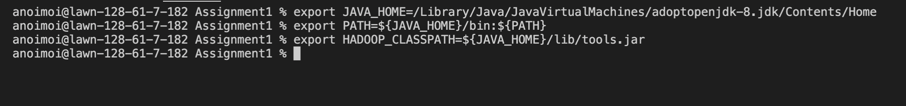
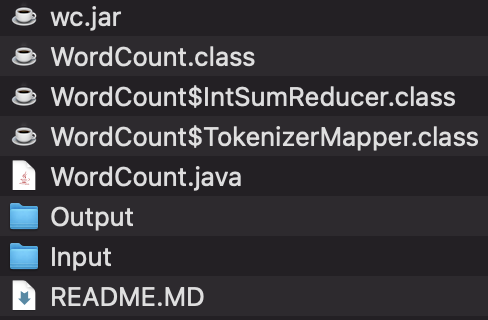
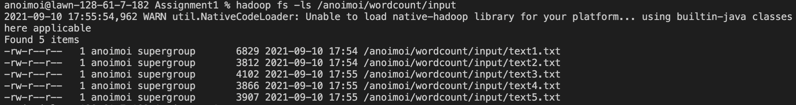
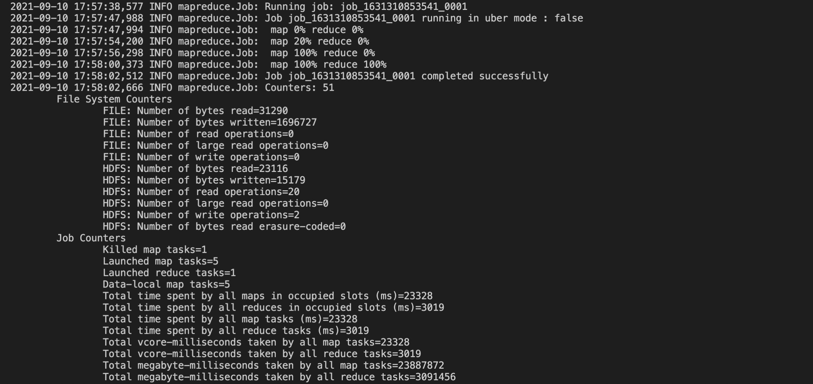

# Learning Distributed/Parallel Big Data Computing with Hadoop MapReduce

The option chosen for this assignment is Problem1-option1. For the full description of the problem, refer to `2021-ProgrammingAssignment-1.pdf`. The PDF also has descriptions of other problems and options given as a part of the assignment.

**Note:** This README is a brief overview of the directory and the steps to run the code, along with a sample run. For the Analytical Report of experiments, refer to `AnalysisReport.pdf`. Took have a look at all commands ran as part of the experiments, look into the `Screenshots` folder.


## Directories Explained

The `Input` is a collection of all text files that were fed into HDFS during the experiment. It has 2 sets with size of 20 files (small-medium) with the naming `text(1?)[0-9].txt` and the folder `gutenberg`, and a few more larger files. If attempting to reproduce the experiment on a subset of files, you must copy the amount of files needed onto HDFS using the commands below (see: [Load Data](#load-data)).

The `Output` is the collection of outputs generated by WordCount and TopN programs. The naming tries to be indicative of which program the output if from.

Screenshots contain snaps of executed programs on a certain amount of data and in certain settings. The naming tries to be indicative of what they represent, and this README will refer to them occasionally.

`WordCount.java` is the vanilla Java program in Hadoop MapReduce [tutorial](https://hadoop.apache.org/docs/stable/hadoop-mapreduce-client/hadoop-mapreduce-client-core/MapReduceTutorial.html). It counts the number of occurences of ALL words in any given set of files in an input directory. 

`TopN.java` is a [code](https://awesomeopensource.com/project/andreaiacono/MapReduce) that uses MapReduce paradigm to arrive at the Top N most occurred words in a given set of text files. 

`Plotter.py` is a Python code that uses the matplotlib library to plot the runtime results for TopN and WordCount codes.


## To Run

**Note:**

These instructions assume that Hadoop is installed and is working on your computer(s). If not, please refer to their instructions to install [here](https://hadoop.apache.org/docs/stable/hadoop-project-dist/hadoop-common/SingleCluster.html).

Once Hadoop is installed, it is recommended to format your namenode if you are trying to start with a fresh HDFS. 

**Warning**: Doing so will erase all your previous files in HDFS.

Follow these steps to reset your namenode.
```
stop-all.sh
hadoop namenode -format
start-all.sh
```

### Set Environment Variables

```
export JAVA_HOME=/usr/java/default
export PATH=${JAVA_HOME}/bin:${PATH}
export HADOOP_CLASSPATH=${JAVA_HOME}/lib/tools.jar
```

Please ensure your JAVA_HOME location matches with the Input. For reference, my Location is `/Library/Java/JavaVirtualMachines/adoptopenjdk-8.jdk/Contents/Home`, but the abovementioned location usually matches installations on Linux environments.

### Compile
First, compile the mapreduce code. 

```
hadoop com.sun.tools.javac.Main foo.java
```

where foo = TopN or WordCount

**Note:** Change the `hadoop` to reflect its location on your system.

Make a jar using either of these commands:

```
jar cf wc.jar WordCount*.class
```
or
```
jar cf topn.jar TopN*.class
```
### Load Data
```
hadoop fs -mkdir -p /user/input
hadoop fs -put /<fs path of file> /user/input
```

### Run

```
hadoop jar wc.jar WordCount /user/input /user/output
```
or
```
hadoop jar topN.jar TopN /user/input /user/output
```

### Get the Output back to the File System

```
hadoop fs -get /user/output/part-r-<reducernumber> Output
```

where the `reducernumber` starts from 00000 

## Software/Tools Used

To generate/assemble data, the following tools/sources have been used.

http://www.randomtextgenerator.com to generate 20 smaller text files . See `Input/text(1?)[0-9].txt`

20 books (or their parts), including Huckleberry Finn and Following the Equator, were used from the [Gutenberg](https://www.gutenberg.org/browse/authors/t#a53) project as the corpus to run the topN program.

Some very large files (in Calgary, Cantrbry folders) used for scaling tests were picked up from the Canterbury [Corpus](https://corpus.canterbury.ac.nz/descriptions/#artificl).


Also, Apache Hadoop framework was used to process and run MapReduce applications. It can be installed following this [link](https://hadoop.apache.org/docs/stable/hadoop-project-dist/hadoop-common/SingleCluster.html).


## A Sample Execution Run

Following the instructions [to run](#to-run), here is a sample run on my machine:

The Environment Variables are set using the commands shown below. 


The WordCount Program has been compiled using:


Files to see after compilation:



Files put in HDFS (5 in this example):


Running WordCount on 5 files:


Getting Output back to File System:


The final output of this example can be viewed in `Output/vanillaWC5File.txt`