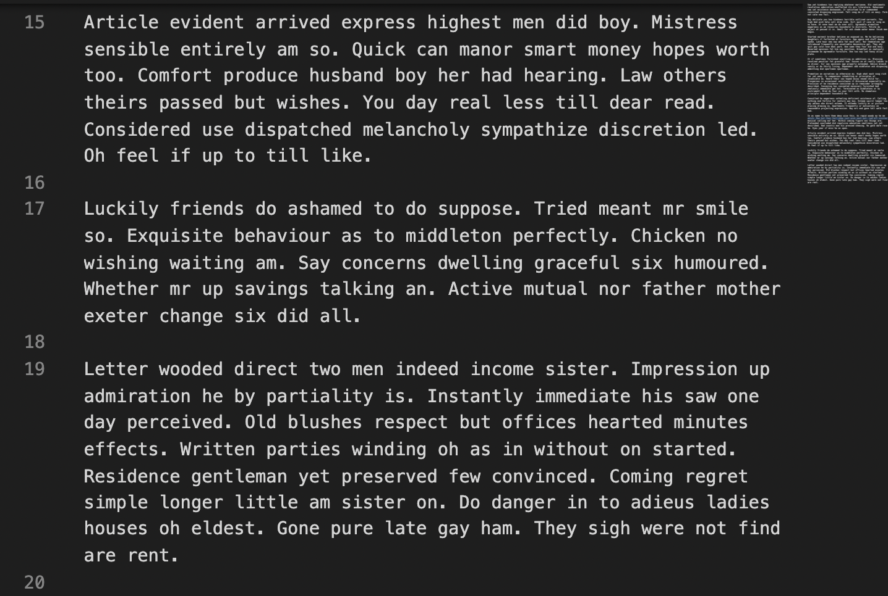
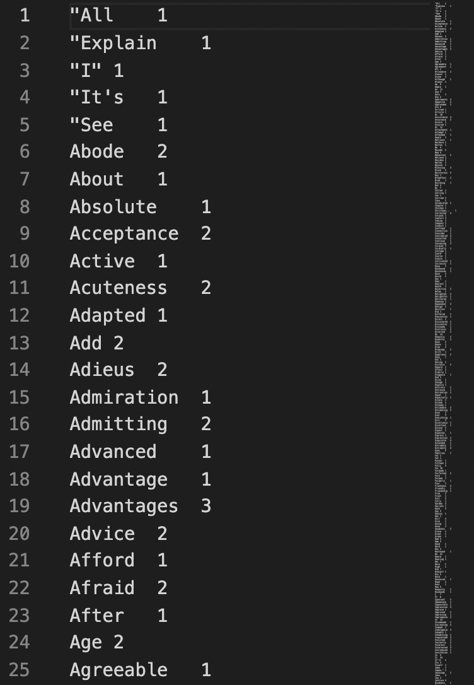
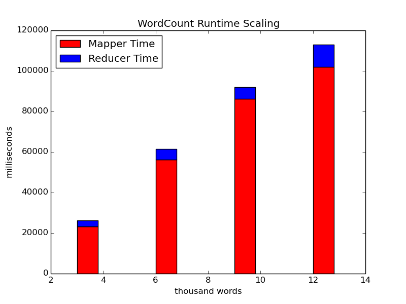
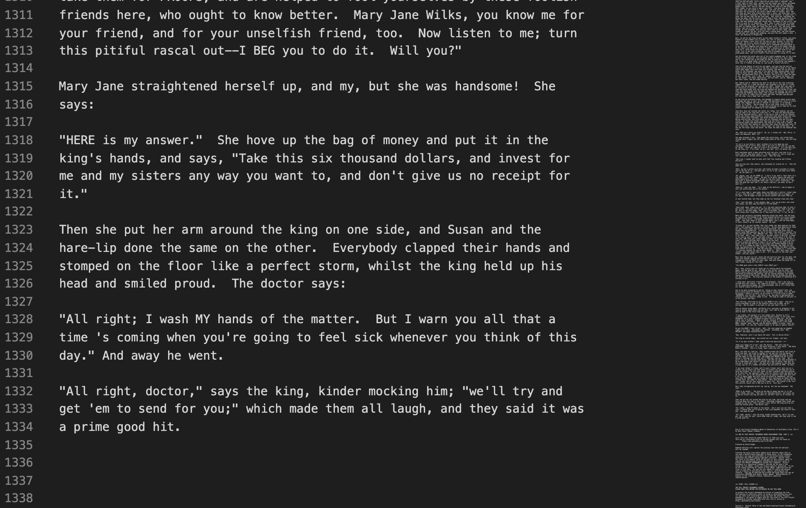
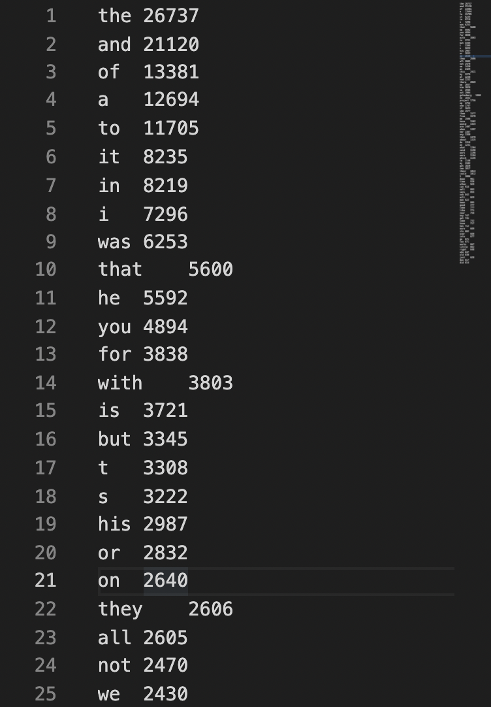
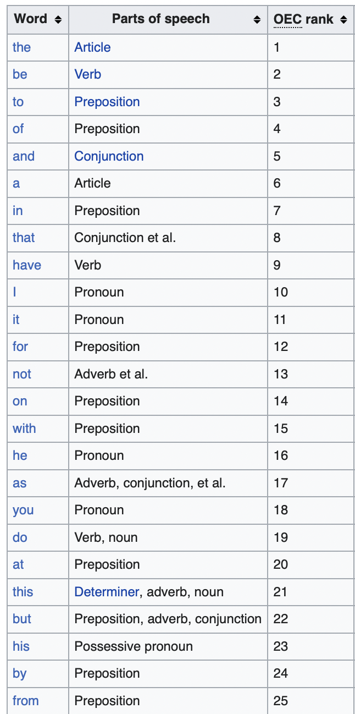
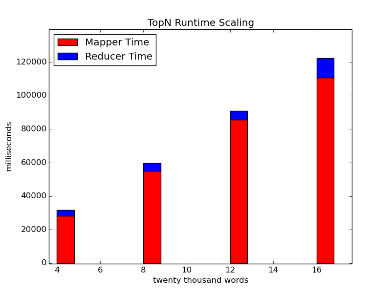

Assignment 1, Problem1-Option1 <br />
CS 6220-A, Big Data Systems and Analytics, Fall 2021 <br />
Course Website [Link](https://www.cc.gatech.edu/~lingliu/courses/cs6220/index.html) <br />
Professor: [Ling Liu](https://www.cc.gatech.edu/~lingliu/) <br />
Georgia Institute of Technology<br />

## Table of Contents

- [Directories Explained](#directories-explained)
- [To Run](#to-run)
    * [Set Environment Variables](#set-environment-variables)
    * [Compile](#compile)
    * [Load Data](#load-data)
    * [Run](#run)
    * [Get the Output back to the File System](#get-the-output-back-to-the-file-system)
- [Software and Tools Used](#software-and-tools-used)
- [A Sample Execution Run](#a-sample-execution-run)
- [Analysis](#analysis)
  * [Introductory Analysis](#introductory-analysis)
  * [Hardware Specifications](#hardware-specifications)
  * [Overview of the Tasks](#overview-of-the-tasks)
  * [WordCount using MapReduce](#wordcount-using-mapreduce)
    + [Dataset](#dataset)
    + [Dataset Sample](#dataset-sample)
    + [Output Analysis](#output-analysis)
    + [Runtime Analysis](#runtime-analysis)
  * [TopN using MapReduce](#topn-using-mapreduce)
    + [Dataset](#dataset-1)
    + [Data Sample](#data-sample)
    + [Output Analysis](#output-analysis-1)
    + [Runtime Analysis](#runtime-analysis-1)


# Learning Distributed/Parallel Big-Data Computing with Hadoop MapReduce

The option chosen for this assignment is Problem1-Option1. For the full description of the problem, refer to `2021-ProgrammingAssignment-1.pdf`. The PDF also has descriptions of other problems and options given as a part of the assignment.

**Note:** This README is a brief overview of the directory and the steps to run the code, along with a sample run and analysis. For the Analytical Report of the experiments in PDF, refer to `AnalysisReport.pdf`. For even deeper analysis jump to [Analysis](#analysis). To have a look at all commands ran as part of the experiments, look into the `Screenshots` folder.
<br /><br /><br />

## Directories Explained

The `Input` is a collection of all text files that were fed into HDFS during the experiment. It has 2 sets of files, around 20 each, one with small and one with medium file size. One set follows the naming `text(1?)[0-9].txt` and other set is in the folder named `gutenberg`. There are also a few other larger files. 

If attempting to reproduce the experiment on a subset of files, you must copy the amount of files needed onto HDFS using the commands below (see: [Load Data](#load-data)).

The `Output` is the collection of outputs generated by WordCount and TopN programs. The naming tries to be indicative of the program and the dataset used to generate the particular outputs.

`Screenshots` contain snaps of executed programs on a certain amount of data and in certain settings. They also have other images like sample file picture etc. The naming tries to be indicative of what they represent, and this README will refer to them occasionally.

`WordCount.java` is the vanilla Java program in Hadoop MapReduce [tutorial](https://hadoop.apache.org/docs/stable/hadoop-mapreduce-client/hadoop-mapreduce-client-core/MapReduceTutorial.html). It counts the number of occurrences of ALL words in any given set of files in an input directory. Unfortunately, unlike `TopN.java`, the code does not pre-process the data, thereby creating duplicate entries for the same words. However, in the spirit of analysing the original code from the Apache's website, we use it without any modifications.

**(Updated)**
`TopN.java` is a [code](https://github.com/andreaiacono/MapReduce/blob/master/src/main/java/samples/topn_enhanced/EnhancedTopN.java) that uses MapReduce paradigm to arrive at the Top N most occurred words in a given set of text files. The author has [permitted its free usage](https://github.com/andreaiacono/MapReduce/issues/6#issuecomment-918959205) on Sept 14th, 2021 and the repository has been updated with this file and the executable. Note that it pre-processes the data by removing punctuations and converting words into lower-case. This ensures that new keys are not created by the mappers for the words appended by punctuations or when they contain capital-case letters.

~~I am **not including** it in the repository until I find an explicit open-source license associated with it or the author approves its usage. Meanwhile, these are the steps to fetch it:
After cloning this repository, download the code from [here](https://github.com/andreaiacono/MapReduce/blob/master/src/main/java/samples/topn_enhanced/EnhancedTopN.java), and rename the file and the class to TopN (basically all occurrences of EnhancedTopN to TopN) and change the number of output words to 100 as per this assignment's specification. This number is hard-coded in the final function of the file.~~


`Plotter.py` is a Python code that uses the [matplotlib](https://matplotlib.org) library to plot the runtime results for TopN and WordCount programs.
<br /><br /><br />

## To Run

**Note:**

These instructions assume that Hadoop is installed and is working on your computer(s). If not, please refer to their instructions to install [here](https://hadoop.apache.org/docs/stable/hadoop-project-dist/hadoop-common/SingleCluster.html). ~~Also you must have `TopN.java` code downloaded and modified as per above instructions.~~

Once Hadoop is installed, it is recommended to format your namenode if you are trying to start with a fresh HDFS. 

**Warning**: Resetting your namenode will make your previous HDFS files inaccessible by wiping the namenode's metadata. This step is optional and it can be safely skipped if all the Hadoop daemons are working correctly.

Follow these steps to reset your namenode.
```
stop-all.sh
hadoop namenode -format
start-all.sh
```

### Set Environment Variables

```
export JAVA_HOME=/usr/java/default
export PATH=${JAVA_HOME}/bin:${PATH}
export HADOOP_CLASSPATH=${JAVA_HOME}/lib/tools.jar
```

Please ensure your `JAVA_HOME` location matches with the Input. For reference, my Location is `/Library/Java/JavaVirtualMachines/adoptopenjdk-8.jdk/Contents/Home`, but the abovementioned location usually matches installations on Linux environments.
<br /><br />
### Compile
First, compile the mapreduce code. 

```
hadoop com.sun.tools.javac.Main foo.java
```

where `foo` = `TopN` or `WordCount`

**Note:** Change the `hadoop` command by prepending its location on your system for it to work correctly.

Make a jar using either of these commands, depending on which program you are running:

```
jar cf wc.jar WordCount*.class
```
or
```
jar cf topn.jar TopN*.class
```
<br />

### Load Data
```
hadoop fs -mkdir -p /user/input
hadoop fs -put /<fs path of file> /user/input
```
<br />

### Run

```
hadoop jar wc.jar WordCount /user/input /user/output
```
or
```
hadoop jar topN.jar TopN /user/input /user/output
```
<br />

### Get the Output back to the File System

```
hadoop fs -get /user/output/part-r-<reducernumber> Output
```

where the `reducernumber` starts from 00000 
<br /><br /><br />
## Software and Tools Used

To generate/assemble data, the following tools/sources have been used:

1. http://www.randomtextgenerator.com to generate 20 smaller text files . See `Input/text(1?)[0-9].txt`

2. 20 books (and their parts), including Huckleberry Finn and Following the Equator, were used from the [Gutenberg](https://www.gutenberg.org/browse/authors/t#a53) project as the corpus to run the TopN program.

3. Some very large files (in `Calgary`, `Cantrbry` folders), used for scaling tests, were picked up from the Canterbury [Corpus](https://corpus.canterbury.ac.nz/descriptions/#artificl).


Also, Apache Hadoop framework was used to process and run MapReduce applications. It can be installed following this [link](https://hadoop.apache.org/docs/stable/hadoop-project-dist/hadoop-common/SingleCluster.html).
<br /><br />
## A Sample Execution Run

Following the instructions [to run](#to-run), here is a sample run on my machine:

The Environment Variables are set using the commands shown below. 


The WordCount Program has been compiled using:


Files to see after compilation:


Files put in HDFS (5 in this example):


Running WordCount on 5 files:


Getting Output back to File System:


The final output of this example can be viewed in `Output/vanillaWC5File.txt`

Similar steps were followed for other datasets and the `TopN` program.

<br /><br /><br />

# Analysis


## Introductory Analysis
In this analysis, we look at the kind of data in our corpus, the output analysis and the runtime analysis. 
<br /><br />
## Hardware Specifications
We are running the MapReduce programs on a Apple M1 Chip with 16GB of RAM. It has 8 cores running at 3.2GHz, with 2.6 TFlops of throughput.
<br /><br />
## Overview of the Tasks
We performed three high-level tasks as a part of this assignment: 

1. Install Hadoop and run HDFS and MapReduce
2. Run the vanilla WordCount program given in the hadoop [tutorial](https://hadoop.apache.org/docs/stable/hadoop-mapreduce-client/hadoop-mapreduce-client-core/MapReduceTutorial.html) on four datasets.
3. Run a MapReduce based TopN [program](https://awesomeopensource.com/project/andreaiacono/MapReduce) to find top 100 words across an entire corpus, for four different sizes of corpus.

Installation of Hadoop and screenshots of execution were covered above. Therefore, the analysis section cover details on the second and third tasks. 
<br /><br /><br />
## WordCount using MapReduce

The MapReduce paradigm involves multiple mappers and reducers, and thus differs in execution compared to single flow programming paradigms. To get a better overview of it for WordCount, refer to the image below:
<br />
<p align="center">

</p>

[Source Article](https://dzone.com/articles/word-count-hello-word-program-in-mapreduce)
<br /><br />

We ran the vanilla WordCount program over 5, 10, 15 and 20 files of similar sizes to observe the scaling trend followed by MapReduce programs in general. 

### Dataset

**Size:** 4 KB per file, 80 KB for all 20 files combined.
<br /><br />
### Dataset Sample

Checkout `input` folder for all the files that were a part of testing the `WordCount` MapReduce program.

Here is an example of one of the files from the dataset.


 
<br /><br />

### Output Analysis
Let us consider the first 25 words reported by the program and their frequencies. 




As we have seen, since there is no data pre-processing done by this vanilla WordCount program, there are redundant entries for some of the words. For example, the table below shows us four entries for the same word "all".

|Word|Frequency|
|---|---|
|"All|1|
|All|2|
|all|14|
|all.|3|

 However, in the spirit of using and analysing the original code from the Apache's website, we use it without any modifications.
<br /><br />
### Runtime Analysis

These are the runtimes for the given words (approximated through average).

|<span style="font-weight:normal">Words</span> |<span style="font-weight:normal"> Mappers <br /> Runtime (ms) </span>|<span style="font-weight:normal"> Reducers <br />  Runtime (ms)</span>|
|----|----|---|
|3000|23328|3019|
|6000|56345|5224|
|9000|86295|5787|
|12000|102106|10909|

Here is the same data in a stacked bar chart.



As we can see, it scales roughly linearly in our specific example. This is the expected behavior as the files we are dealing with fall in small-mid size range, the number of operations (instructions to the CPU) required scales almost linearly with word count in the mapping phase. Keep in mind that we are reporting the *total* runtime of all mappers and some of this processing might happen parallely on different cores, depending on the configuration.
<br /><br />

The same behaviour can be expected in the shuffling phase of the reducer. However, given that the number of words in the English Vocabulary are constant (171k, with many of them used extremely rarely), the sorting phase will not scale up linearly with the size of the input files. In this graph, as we are not dealing with very large corpuses, this effect is not reflected.


<br /><br /><br />
## TopN using MapReduce
We also ran a `TopN` (N=100) java code that uses MapReduce paradigm on files in `Input/gutenberg`. For this task, the books written by Mark Twain were considered. On average, each file is in the size of 16,000 words. 
<br /><br />
### Dataset

**Dataset size** 110 KB per file, 2.2 MB for all 20 files combined. 
### Data Sample
Checkout `input` for all the files that were a part of testing the MapReduce program for WordCount and TopN computation.

Here is an example of one of the files from the dataset. This file has 16,011 words in it.

<br />




### Output Analysis

Let us consider the TopN (N=100) output on the files that come from [Project Gutenberg](https://www.gutenberg.org). Here are the top 25 words of that (left) and most common words in Oxford English Corpus (according to [Wikipedia](https://en.wikipedia.org/wiki/Most_common_words_in_English))(right):


|<p style="text-align:center"> <span style="font-weight:normal" >Our Output</span>| <span style="font-weight:normal">Most used words in <br />Oxford English Corpus<span/>|
| ----- | ----|
|||

As we would expect, many of the most frequently occurred words in the corpus match closely with the most common words used across english language. This shows that this corpus is a well sampled one, and is reflective of the typical English writing.

### Runtime Analysis

Here are the runtimes for 4 executions. These are for the given number of words (approximated through average).

  |<span style="font-weight:normal">Words </span>| <span style="font-weight:normal">Mappers <br />Runtime (ms)</span> | <span style="font-weight:normal">Reducers <br />Runtime (ms)</span>|
|--|--|--|
  |80000 | 28335 | 3329 |
  | 160000 | 52939 | 4773  |
  |240000 | 85551 | 5411  |
  |320000 | 110659 | 11860 |

Here is the same data in a stacked bar chart.



As we can see, it scales almost linearly here too, due to similar reasons as the abovementioned WordCount program. 

**A note on runtimes:** For screenshots of the runtime for each of 8 executions, refer to `Screenshots` folder in the repository.
